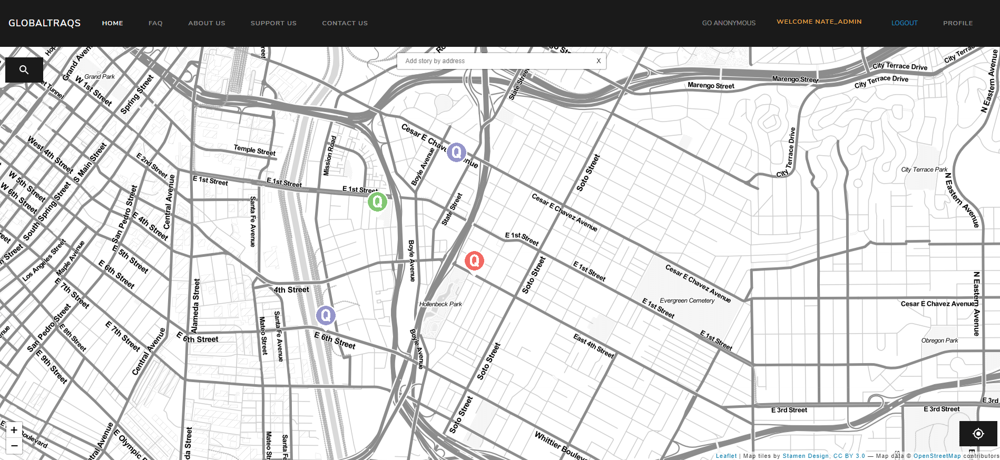
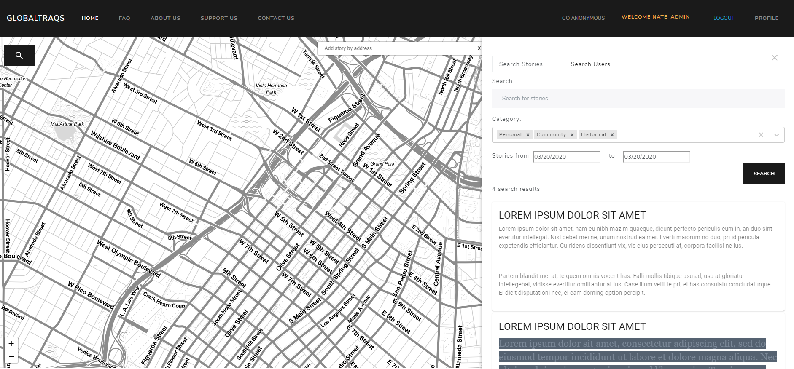
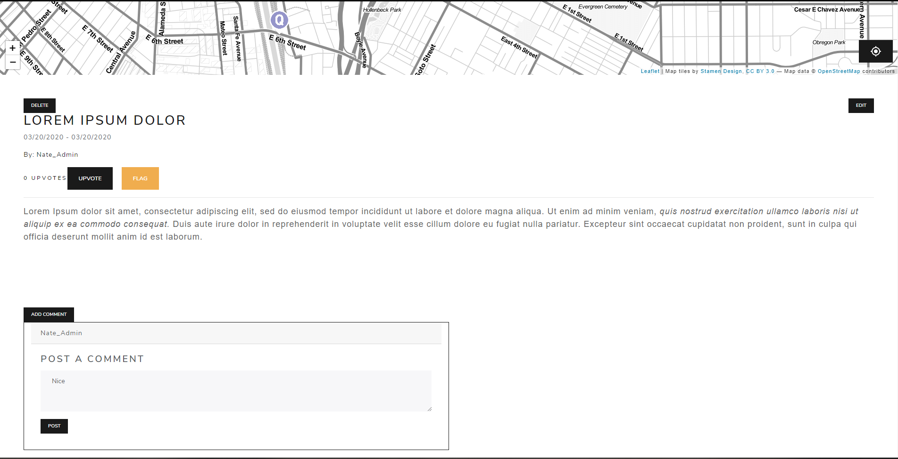
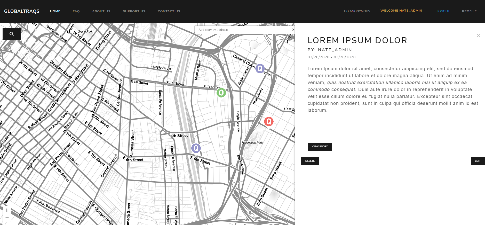

# THIS BRANCH IS A WORKING OLD BACKUP. TO BE SURE YOU HAVE THE LATEST CHANGES CREATE A NEW DEVELOPMENT BRANCH OFF OF 'production' BRANCH

1. [About](https://github.com/balacarter/GlobaltraQs/blob/master/README.md#about)
1. [Rules](https://github.com/balacarter/GlobaltraQs/blob/master/README.md#rules)
1. [Instructions](https://github.com/balacarter/GlobaltraQs/blob/master/README.md#globaltraqs) 
1. [Running](https://github.com/balacarter/GlobaltraQs/blob/master/README.md#running)
1. [Screenshots](https://github.com/balacarter/GlobaltraQs/blob/master/README.md#screenshots)

# About

Senior Design Project of redesigning of the website : [The ArQive](http://thearqive.com/)
Still In Development

# Rules 
Contribution Rules

✔️ Never work on master or production branch!

⚠️ Be sure to branch off the development branch for features WIP

⚠️ Branch off of the production branch for hot fixes

✔️ Create a new branch for each set of related bugs or set of related tasks, naming by:

type_PascalCase, example: feat_CareerPage, bug_CareerEmail.

Common short type tokens: wip (work in progress), feat (feature or design), bug (bug fixes)

💻 command to create new branch locally: git checkout -b bug_CareerEmail

⚠️ Important: Before creating a branch, check if someone already started to work on this task and if there's already a branch created for this task, and if there is, please checkout and track the branch with the 💻 command: git checkout --track origin/bug_CareerEmail

--track shorthand for git checkout -b [branch] [remotename]/[branch] where remote name is origin and branch is the specific branch you're pulling from the origin remote

Right after creating a new branch, push it to remote to make it available for everyone, defining the upstream

💻 command: git push -u origin bug_CareerEmail

✔️ Everyday after working, push your local branch updates to remote branch.

⚠️ Important: make sure you're on the correct branch... and push

With 💻 command: git push

✔️ Finished with the task and want to merge?

Fix conflicts if needed, usually happens when more than 1 developer is working on the same file on different branches - communicate with the other developer to make sure their work was not removed

Please make the merge/pull request with as much detail about what you've done/added.

Or lead will merge your branch to master for you. Just ask!

# GlobaltraQs

developmental version: http://globaltraqsdev.com/

# Setup guide

This is only a guide and does not work for all systems. Try googling errors and changing versions. Production uses Ubuntu 18.0.4 and Python 3.6.9

0. Update and Download repos
    
    `sudo apt-get update`
    
    `sudo apt -y upgrade`
    
    `git clone https://github.com/kennardlim1220/thearqive-backend.git`
    
    `git clone https://github.com/kennardlim1220/arQive-frontend.git`

1. Install python3.7 and pip 3

    Navigate to home dir

    `cd ~`

    Get latest from server

    `sudo apt update`
    
    Add third party repo for python 3.7
    
    `sudo apt install software-properties-common`
    
    `sudo add-apt-repository ppa:deadsnakes/ppa`
    
    Install python3 from repo
    
    `sudo apt install python3.7`

    Use `python3.7 -V` to verify python 3.7.x has been installed
    
    Install pip3
    
    `sudo apt install -y python3-pip`
    
    Use `pip3 -V` to verify pip has been installed
    
2. Install and setup Postgresql

    Get build essentials

    `sudo apt install build-essential libssl-dev libffi-dev python3.7-dev libpq-dev postgresql postgresql-contrib`
    
    Start DB - Use the following line to start DB everytime you restart Linux
    
    `sudo service postgresql start`
    
    Log in to postgres
    
    `sudo -i -u postgres`
    
    Start psql
    
    `psql`
    
    Create a new DB
    
    `CREATE DATABASE devdb;`
    
    Create a new user for DB
    
    `CREATE USER admin WITH PASSWORD 'adminpassword';`
    
    Adjust user settings
    
    `ALTER ROLE admin SET client_encoding TO 'utf8';`
    
    `ALTER ROLE admin SET default_transaction_isolation TO 'read committed';`
    
    `ALTER ROLE admin SET timezone TO 'UTC';`
    
    Make your new user an admin of your new DB
    
    `GRANT ALL PRIVILEGES ON DATABASE devdb TO admin;`
    
    (you can make you own db name, username, and password, these will change in production builds for security, be sure to remember your info for creating superusers)
    
    Quit psql
    
    `\q`
    
    Exit postgres
    
    `exit`
    
3. Create Python virtual environment

    Navigate to GlobaltraQs Repo
    
    `cd GlobaltraQs`
    
    Install pipenv
    
    `sudo pipenv install
    
    Start virtual environment in GlobaltraQs repo
    
    `sudo pipenv shell`
    
4. Install django and dependencies

    Make sure you are still in /GlobaltraQs/
    
    Make sure the virtual environment is activated 

    `sudo pipenv shell`
    
    Install project requirements
    
    `pip3 install -r requirements.txt` (this command crashes on installing psycopg2 but also installs psycopg2-binary which is a working fix)
    
    Install missing dependencies
    
    `pip3 install psycopg2-binary python-decouple djangorestframework jinja2 boto3 djangorestframework-api-key django-rest-knox django-restql django-decouple Pillow`
    
5. Update settings.ini

    Edit settings.ini in GlobaltraQs/GlobalTraqs/
    
    `nano GlobaltraQs/GlobalTraqs/settings.ini`
    
    Can copy and paste from below or fill in your own.
    
    [settings]
    
    DEBUG=True
    
    SECRET_KEY=''
    
    NAME: devdb
    
    USER: admin
    
    PASSWORD: adminpassword
    
    HOST: localhost
    
    PORT: 5432
    
    EMAIL_USE_TLS=True 
    
    EMAIL_PORT= 587
    
    EMAIL_HOST_USER = 'resetglobaltraqs@gmail.com'
    
    EMAIL_HOST_PASSWORD = 'nmjpfuuvopvbmeri'

    (again these values will change for deployments)
    
    ctrl + x, y, then enter to save
    
6. Migrate, Create a superuser, and Start backend
    Note:this is a temporary commit from Kennard but if you are on the Ubuntu server, you must:
    1. `nano /Globaltraqs/Globaltraqs/settings.py` (File inside 1 layer deeper than setting.ini)
    2. add '*' to allowed host and save the file (ctrl x, y, enter)
    3. shutdown the virtual machine
    4. In Virtual Box, click settings -> Network and change NAT to Bridged Adapter
    5. Turn on the virtual machine
    6. use `ip addr` o get your virtual machine ip address. Look for inet to get your ip address.
        - If you only have inet6 (ipv6), turn off the machine, change it back to NAT, turn it on, turn it off, change if back to bridge, and turn it on again.
          If that doesn't, come to the meeting.
        Ignore this if you are using the Ubuntu GUI

    In /GlobaltraQs/Globaltraqs/
    
    Set up DJANGO migrations

    `python3 manage.py makemigrations`
    
    Migrate DJANGO to DB
    
    `python3 manage.py migrate`
    
    Create a superuser to login to DJANGO backend

    `python3 manage.py createsuperuser` - Make it simple and obvious for local dev
    
    Start DJANGO backend

    `python3 manage.py runserver`
    - If you are using Kennard optional instruction, then run `python3 manage.py runserver 0.0.0.0:8000` instead.
    - To access, use the virtual machine ip address. My ip was 192.168.1.183, so I would use `http://192.168.1.183:8000` in your host machine browser.
    
7. Generate API key for frontend
    
    With the DJANGO server running from the previous step, navigate to http://127.0.0.1:8000/admin and log in with the superuser account you made
    
    Generate a new API key (any expiration date)
    
    Copy the key (including the prefix) from the yellow pop up at the top of the page
    
    Add the key to frontend .env file (ssh into arqive server and retrieve the correct env from /carterb/)
    
8. Create user groups - This section is a WIP

    With the DJANGO server running from the previous step, navigate to http://127.0.0.1:8000/admin and log in with the superuser account you made
    
    Go to Authentication and Authorization
    
    Create new groups for Administrators, Moderators, and Anonymous with aproriate permissions assigned
    
    Work in Progress: No definite answers for which exact permissions to add, I assume admins get all permissions and anonymous gets none
    
9. Add categories for pins in DB

    Exit virtual environment or open a new terminal
    
    `cd ~`
    
    Login to postgres
    
    `sudo -i -u postgres`
    
    Start psql
    
    `psql`
    
    Connect to DB you made
    
    `\c devdb`
    
    At categories using SQL
    
    `INSERT INTO pins_categorytype VALUES (1, 'Personal', '');`
    
    `INSERT INTO pins_categorytype VALUES (2, 'Historical', '');`
    
    `INSERT INTO pins_categorytype VALUES (3, 'Community', '');`
    
    Quit psql
    
    `\q`
    
    exit postgres
    
    `exit`
    
10. Populate DB with pre-made stories

    Make sure your in GlobaltraQs/GlobalTraqs
    
    Enter DJANGO shell
    
    `python3 manage.py shell`
    
    Start python script to populate DB
    
    `exec(open('old_story_upload.py').read())`
    
11. Start Frontend

    In a new terminal open the arQive-frontend dir
    
    Download nodejs
    
    `curl -sL https://deb.nodesource.com/setup_10.x -o nodesource_setup.sh`
    
    `sudo bash nodesource_setup.sh`
    
    Install nodejs
    
    `sudo apt install nodejs`
    
    Install node modules
    
    `npm install`
    
    Start frontend
    
    `npm start`
    
    
# old instructions

# settings.ini

1. open up settings.ini

1. Development Set Debug = True; Production = False

1. Input DB info * could use local postgres or sqlite. Ask for Online DB

1. Input Email Info *dont use your personal email. Ask for Email prod

# first terminal

1. install Python 3.7, pip 

1. pip install pipenv

1. pipenv install

1. pipenv shell

1. cd GlobalTraqs

1. python manage.py makemigrations

1. python manage.py migrate

1. python manage.py runserver

# second terminal

1. install latest version of node

1. npm install

1. npm run dev

clear cache in browser

# Running

1. Go to http://127.0.0.1:8000/admin/ and log into superuser account
1. Click Groups
1. Create groups (Administrators, Moderators, and Anonymous)
1. Assign appropriate permissions (will add more permissions later)
1. http://127.0.0.1:8000/api/category 
    1. add Personal, Historical, Community 
    1. Adds the categories

# ScreenShots

